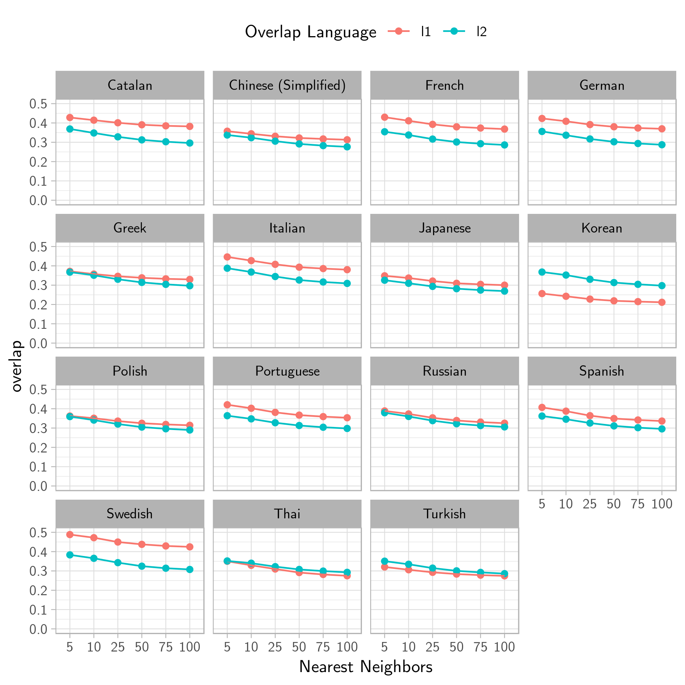

```{r setup, include=FALSE}
knitr::opts_chunk$set(echo = FALSE, warning = FALSE, message = FALSE)
library(tidyverse)
library(boot)
library(philentropy)
# library(kableExtra)
# library(knitr)

options(scipen = 99)
set.seed(1234)

overlaps <- read_csv("../data/ms_final_experiments.csv") %>%
  mutate(case_id = paste0("case_", str_pad(row_number(), width = 4, pad = "0")))

cases <- overlaps %>%
  select(case_id, person_id = id, language, type)
```

# Abstract

# Dataset

We use the Cambridge Learner Corpus - First Certification in English (CLC - FCE) corpus by Yannakoudakis et al (2011). The CLC-FCE corpus has 1244 short essays responses written by learners of English with 16 different first languages (L1). The corpus is annotated for errors and each error is represented based on the guidelines as stated in Nicholls (2003). There are
 a total of 55895 errors in the corpus.

For the purposes of measuring semantic errors, we take into account the errors involving content word corrections (n = 6837). Out of the content word based corrections, we only consider errors involving single word error corrections, reducing the total number to 5521.


# Experiments

The goal of this paper is to compare two hypotheses:

1. Do Vector Semantic models reflect L1 influence in learner english (L2) errors. 
2. Whether L1's influence on Learner Errors for typologically related languages is expressed by vector semantic models.

## Translations

For each of the *(incorrect, correct)* pairs, we translate it into the person's L1 language using the Microsoft Azure Text translation API ^[https://docs.microsoft.com/en-us/azure/cognitive-services/Translator/reference/v3-0-reference]. We use this API because unlike Google's Cloud API for translations, it provides us with alternate pronunciations which prove beneficial while querying for words that can be expressed with different parts of speech. We then remove all multi-word translations of the errors pairs, ending up with 4937 error pairs. Table 1 shows the number of error-cases for each language

```{r}
translated <- read_csv("../data/english_overlaps.csv")

translated %>%
  count(language, sort = T) %>%
  knitr::kable()
```


### Hypothesis 1 (H~1~): Do Vector Semantic models reflect L1 influence in learner english (L2) errors 

We test H~1~ by introducing a metric known as *Semantic Error Overlap* (SEO). Formally, we define SEO for language $L_j$ as: 

\[
  SEO_{L_j}(i, c) = \frac{1}{2k}[\sum_{c'\in N^j_k(c)}cos(i, c') + \sum_{i'\in N^j_k(i)}cos(c, i')]
\]

Where $i', c'$ are nearest neighbors in the set $N_k(.)$ of the $k$ nearest neighbors of the words $i$ (incorrect) and $c$ (correct) respectively, in a given vector space. Since we have the $(i, c)$ pairs in both languages, we compute the SEO for L1 and L2(english) for each case. 

Intuitively, the SEO of a language will give us a symmetric measure of how close i and c are in their semantic space (for that language) based on their nearest neighbors, or the words they are most associated to. This is not the same as semantic similarity since vector space based on co-occurence relative to a context measure relatedness or association rather than similarity in meanings (cite).

Figure 1 shows the average overlap for the L2 (English) and the respective L1 vector space for all the languages in the corpus. We test for k = 5, 10, 25, 50, 75, and 100.

```{r fig.cap="(add caption)", fig.pos='h'}
avg_overlaps <- overlaps %>%
  filter(language != "Dutch") %>%
  select(-c, -i, -l1_c, -l1_i, -code, -case_id) %>%
  gather(l2_sim_cc_5:l1_sim_cc_100, key = "neighbors", value = "overlap") %>%
  mutate(
    # neighbors = as.numeric(str_extract(neighbors, "(?<=cc_).+$*"))
    neighbors = str_replace(neighbors, "_sim_cc_", "_")
  ) %>%
  separate(neighbors, c("overlap_type", "neighbors"), sep = "_") %>%
  mutate(neighbors = as.numeric(neighbors)) %>%
  group_by(language, overlap_type, neighbors) %>%
  summarize(
    overlap = mean(overlap)
  ) %>%
  ggplot(aes(as.factor(neighbors), overlap, color = overlap_type, group = overlap_type)) +
  geom_point() +
  geom_line() +
  facet_wrap(~language) +
  scale_y_continuous(limits = c(0, 0.5)) +
  theme_light(base_family = "CMU Sans Serif") +
  theme(
    legend.position = "top",
    strip.text = element_text(color = "black")
  ) +
  labs(
    color = "Overlap Language",
    x = "Nearest Neighbors"
  )

# avg_overlaps

ggsave("../figures/nearest_neighbor_overlap3.png", avg_overlaps, height = 6, width = 6)

# 
```

\begin{figure}[h]
  \caption {Overlaps for L1 (Red) and L2 (Green) with different Nearest Neighbors, for each language}
  \centering
    \includegraphics[width=1\textwidth]{../figures/nearest_neighbor_overlap3.png}
\end{figure}

We proceed with choosing k as 10 for the time being. 

With k = 10, we test H~1~ by computing the Spearman's $\rho$ between the SEOs of L1 and L2 (i, c) pairs. This will capture the strength of the relationship between how related the two words are in the person's L1 vis-à-vis in L2, English. Table 1 reports the Spearman's $\rho$ for all L1s in the corpus along with the *p-values* as well as the empirical bootstrap confidence interval estimates for 1000 resamples of the overlap values. Figure 2 shows the confidence intervals plotted for the 15 L1s.

```{r}
experiment1 <- overlaps %>%
  filter(language != "Dutch") %>%
  select(case_id, language, type, l2_sim_cc_10, l1_sim_cc_10)

spearman_correlation <- function(df, indices) {
  df <- df[indices, ]
  return(cor(df[, 1], df[, 2], method = "spearman"))
}

strap_ci <- function(x, f = spearman_correlation, n = 1000, type = "basic") {
  strapped <- boot(x, f, R = n)
  ci <- boot.ci(strapped, type = "basic")
  
  result <- tibble(
    low = ci$basic[1, 4],
    high = ci$basic[1, 5]
  )
  
  return(result)
}

results1 <- experiment1 %>%
  group_by(language) %>%
  nest(l2_sim_cc_10, l1_sim_cc_10) %>%
  mutate(
    n = map_dbl(data, nrow),
    correlation_test = map(data, function(x) {
      s <- cor.test(x$l1_sim_cc_10, x$l2_sim_cc_10, method = "spearman", exact = F)
      
      result <- broom::tidy(s) %>%
        select(estimate, p.value)
      
      return(result)
    }),
    bootstrapped_ci = map(data, strap_ci)
  )

results1 %>%
  select(-data) %>%
  unnest() %>%
  arrange(-estimate) %>%
  knitr::kable()
```

```{r}
bootstrap_cis <- results1 %>%
  select(-data) %>%
  unnest() %>%
  mutate(language = fct_reorder(language, estimate)) %>%
  ggplot(aes(estimate, language)) +
  geom_point() +
  geom_errorbarh(aes(xmin = low, xmax = high)) +
  scale_x_continuous(limit = c(0, 1)) +
  theme_light(base_family = "CMU Sans Serif") +
  labs(
    x = "Spearman's Correlation"
  )

ggsave("../figures/bootstrap_cis.png", bootstrap_cis, height = 5, width = 6)
```

\begin{figure}[h]
  \caption{Spearman's Correlation bootstrap estimates}
  \centering
    \includegraphics[width=1\textwidth]{../figures/bootstrap_cis.png}
\end{figure}

We see that the Spearman's $\rho$ between the various L1s, is in the moderate range (0.4 - 0.59), and is significant, as inferred from the bootstrapped confidence intervals as well as the p-values. Some L1s like *Thai* and *Korean* lie in the weak range, indicating that the L1 semantic influence in lexical choice isn't as pronounced in the errors produced in english.

\newpage

### Hypothesis 2 (H~2~): Whether L1's influence on Learner Errors for typologically related languages is expressed by vector semantic models

In order to test H~2~, we consider the different language families the L1s in the FCE data get segregated into - The three separate branches (among many others) of the Indo-European family of languages, *Germanic* L1s (German, Swedish), *Romance* L1s (Spanish, Catalan, French, Italian) and the *Slavic* family (Russian, Polish), the *Asian* L1s (Chinese, Korean, Japanese, Thai). We combine Turkish and Greek into the *Others* category. We then measure the Jensen-Shannon divergence between the distributions of the overlaps between each of these groups and their respective english (i, c) pairs.

(Describe Jensen Shannon Divergence)

Table 2 describes the JSD between each of the language groups in the CLC-FCE data. 

```{r}
experiment2 <- experiment1 %>%
  mutate(
    group = case_when(
      language %in% c("Russian", "Polish") ~ "Slavic",
      language %in% c("German", "Swedish") ~ "Germanic",
      language %in% c("French", "Spanish", "Catalan", "Italian", "Portuguese") ~ "Romance",
      language %in% c("Chinese (Simplified)", "Japanese", "Korean", "Thai") ~ "Asian",
      TRUE ~ "Other"
    )
  ) %>%
  group_by(group) %>%
  nest(l2_sim_cc_10, l1_sim_cc_10) %>%
  mutate(
    divergence = map_dbl(data, function(m) {
      x <- abs(m$l1_sim_cc_10)/sum(abs(m$l1_sim_cc_10))
      y <- abs(m$l2_sim_cc_10)/sum(abs(m$l2_sim_cc_10))
      m <- rbind(x, y)
      jsd <- JSD(m)
      
      return(jsd)
    })
  )

experiment2 %>%
  select(-data) %>%
  rename(Family = "group") %>%
  arrange(divergence) %>%
  knitr::kable()
```

Germanic - least (meaning closer to English).